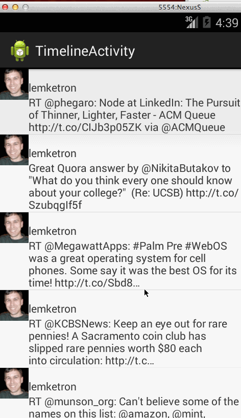

# Simple Twitter Client

Assignment 3 for CodePath Android class
by Keithen Hayenga
24 June 2014

Hours Spent: 20

Description:

Build a simple Twitter client that supports viewing a Twitter timeline and composing a new tweet.

User Stories:

 * [x] User can sign in to Twitter using OAuth login
 * [x] User can view the tweets from their home timeline
 * [x] User should be able to see the username, name, body and timestamp for each tweet
 * [x] User should be displayed the relative timestamp for a tweet "8m", "7h"
 * [ ] User can view more tweets as they scroll with infinite pagination
 * [x] User can compose a new tweet
 * [x] User can click a “Compose” icon in the Action Bar on the top right
 * [x] User can then enter a new tweet and post this to twitter
 * [ ] User is taken back to home timeline with new tweet visible in timeline

The following advanced user stories are optional:

 * [ ] Optional: Links in tweets are clickable and will launch the web browser (see autolink)
 * [ ] Optional: User can see a counter with total number of characters left for tweet
 * [ ] Advanced: User can refresh tweets timeline by pulling down to refresh (i.e pull-to-refresh)
 * [ ] Advanced: User can open the twitter app offline and see last loaded tweets
        Tweets are persisted into sqlite and can be displayed from the local DB
 * [ ] Advanced: User can tap a tweet to display a "detailed" view of that tweet
 * [ ] Advanced: User can select "reply" from detail view to respond to a tweet
 * [ ] Advanced: Improve the user interface and theme the app to feel "twitter branded"
 * [ ] Bonus: User can see embedded image media within the tweet detail view
 * [ ] Bonus: Compose activity is replaced with a modal overlay

Status

Installation Instructions:
 

Libraries Used:

 * ActiveAndroid-3.1-adcddac4c58.jar
 * android-async-http-1.4.3.jar
 * android-support-v4.jar
 * codepath-oauth-0.3.0.jar
 * codepath-utils.jar
 * scribe-codepath.jar
 * universal-image-loader-1.8.4.jar

Notes:

Walkthrough of user stories:

GIFs created with [LiceCap](http://www.cockos.com/licecap/).
